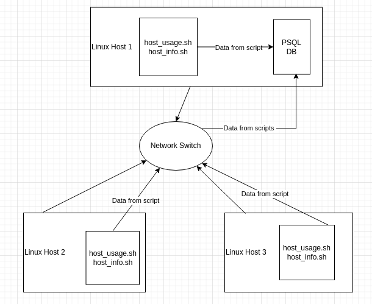

# Linux Clustering Monitoring Agent

# Introduction
The Linux clustering monitoring agent is a tool that allows users to monitor nodes/machines that are connected in a Linux cluster by running 
multiple scripts that collect information of the nodes/machines in regular intervals and logging the data.  The users of this application include Linux Cluster Administration (LCA) teams that
manage Linux clusters consisting of multiple nodes and servers. This tool was built using Linux bash scripts, 
postgres for data storage, git for version control, and docker for hosting of the database. 

# Quick Start
1. Start a psql instance using psql_docker.sh
- If the psql instance hasn't been created yet execute the following
```
./scripts/psql_docker.sh create [db_username][db_password]
```
- If the psql has already been created the following can be executed 
```
./scripts/psql_docker.sh start|stop
```
2. Create tables using ddl.sql
```dockerfile
psql -h localhost -U postgres -d host_agent -f sql/ddl.sql
```
3. Run script that collects hardware spec data into the DB using host_info.sh
```dockerfile
./scripts/host_info.sh psql_host psql_port db_name psql_user psql_password
```
4. Run script that collects hardware usage data into the DB using host_usage.sh
```dockerfile
./scripts/host_usage.sh psql_host psql_port db_name psql_user psql_password
```
5. Setting up the automation of the host_usage.sh script using crontab
- First create a crontab job 
```dockerfile
crontab -e 
```
- Within the job enter the following then save
```dockerfile
* * * * * bash [user home directory]/linux_sql/scripts/host_usage.sh localhost 5432 host_agent postgres postgres > /tmp/host_usage.log
```

# Implementation
- The software is broken into two folders, scripts which includes the scripts host_info.sh, host_usage.sh, and psql_docker.sh.
Which are in charge of creating and running the software. The second folder is sql, which hosts the script ddl.sql which
creates the required tables. 
- For the implementation of this tool, initially the postgres database was set up on a docker container. Afterward a script
to generate the postgres tables to store the hardware spec info and hardware usage info is created. Next up bash scripts 
to collect hardware spec info and hardware usage info were created, and these scripts allow for the collected data to be directly
entered into the postgres database. Lastly, a crontab job was created which allows for the host usage script to be run 
on regular intervals to constantly keep collecting usage data. 

## Architecture


## Scripts
1. psql_docker.sh
- This script is used to create the postgres database on a docker container
- Also is used to start up the postgres database docker container and closing it
2. host_info.sh
- This script is used to collect the hardware spec info of the host machine
- This script also sends in the collected data directly into the corresponding 
host info table in the postgres database
3. host_usage.sh
- This script is used to collect the hardware usage info of the host machine
- This script also sends in the collected data directly into the corresponding
    host info table in the postgres database
4. Crontab
- This command-line utility is a job scheduler, which was used to create a job 
that runs the host_usage.sh script every minute
5. ddl.sql
- This script creates the tables in the database to store the data for host spec and host
usage. The schemas of the tables are also created by this script. 

*** All info on running these scripts is provided in the Quick Start Section ***

## Database Modeling
- The database consists of two tables host_info and host_usage


### `host_info` Table
```
| Column           | Type     | Constraints                  | Description                                         |
|------------------|----------|------------------------------|-----------------------------------------------------|
| `id`             | SERIAL   | PRIMARY KEY                  | Unique identifier for each record                   |
| `hostname`       | VARCHAR  | UNIQUE                       | Hostname of the machine                             |
| `cpu_number`     | INT2     | NOT NULL                     | Number of CPUs on the machine                       |
| `cpu_architecture`| VARCHAR  | NOT NULL                    | CPU architecture (e.g., x86_64)                     |
| `cpu_model`      | VARCHAR  | NOT NULL                     | Model of the CPU                                    |
| `cpu_mhz`        | FLOAT8   | NOT NULL                     | CPU clock speed in megahertz                        |
| `l2_cache`       | INT4     | NOT NULL                     | Size of L2 cache in kilobytes                       |
| `timestamp`      | TIMESTAMP| NULL                         | Timestamp of when the data was recorded (nullable)  |
| `total_mem`      | INT4     | NULL                         | Total memory (RAM) in megabytes (nullable)          |
```
### `host_usage` Table
```
| Column           | Type     | Constraints                  | Description                                         |
|------------------|----------|------------------------------|-----------------------------------------------------|
| `timestamp`      | TIMESTAMP| NOT NULL                     | Timestamp of when the data was recorded             |
| `host_id`        | INT4     | FOREIGN KEY (host_info.id)   | Foreign key referencing the `id` in `host_info`     |
| `memory_free`    | INT4     | NOT NULL                     | Free memory (RAM) in megabytes                      |
| `cpu_idle`       | INT2     | NOT NULL                     | Percentage of CPU idle time                         |
| `cpu_kernel`     | INT2     | NOT NULL                     | Percentage of CPU kernel time                       |
| `disk_io`        | INT4     | NOT NULL                     | Disk I/O operations per second                      |
| `disk_available` | INT8     | NOT NULL                     | Available disk space in bytes                       |

```
# Test
- For the testing of the scripts, after I completed them I ran them with the expected inputs to make sure they ran properly. 
Along with that I also ran multiple different inputs to ensure that the errors would be caught properly by the program
to avoid any crashes. From all the different inputs I used for testing, they all produced the expected results based off
the safety clauses in the scripts. 

# Deployment
- For the deployment of the application, first off the postgres database is hosted on a docker container.
But for all the scripts they all run locally on the user's machine. Crontab is also run locally
on the user's machine for automating the host_usage.ssh script.
- Git was used for version control, and the release ready code has been pushed to GitHub for open source use.

# Improvements
- Some improvements to this tool to make it more advance could include:
- An Alerting Mechanism, to alert the user about a particular machine's current usage if it surpasses a certain threshold set by the user
- A graphical interface to view and analyze historical data on the different machines connected to the cluster
- Some security changes, to protect sensitive data collected by the monitoring agent. This could involve encrypting data both in transit and at rest. Along with
  a secure authentication mechanisms for accessing the monitoring data or performing administrative tasks. This ensures that only authorized individuals can interact with the monitoring system
